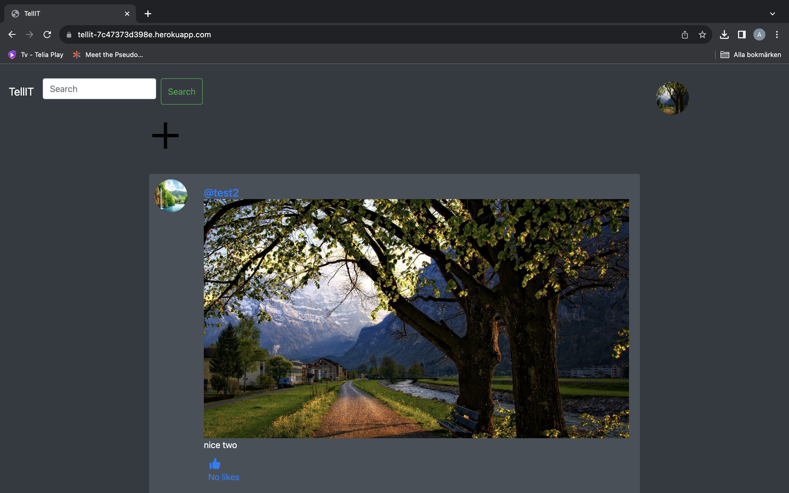
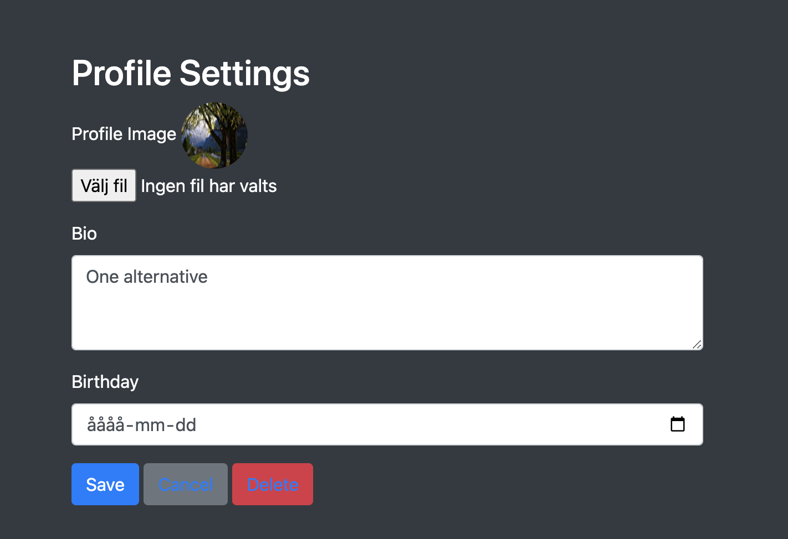
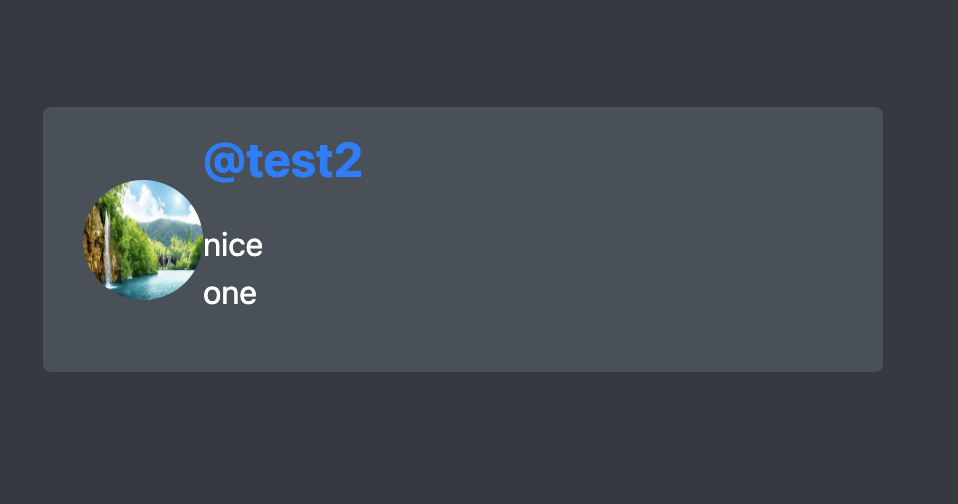
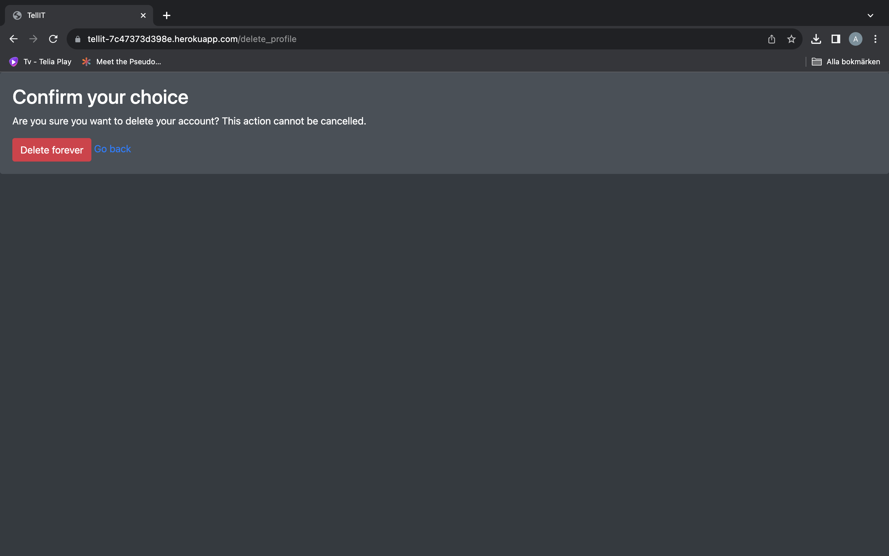
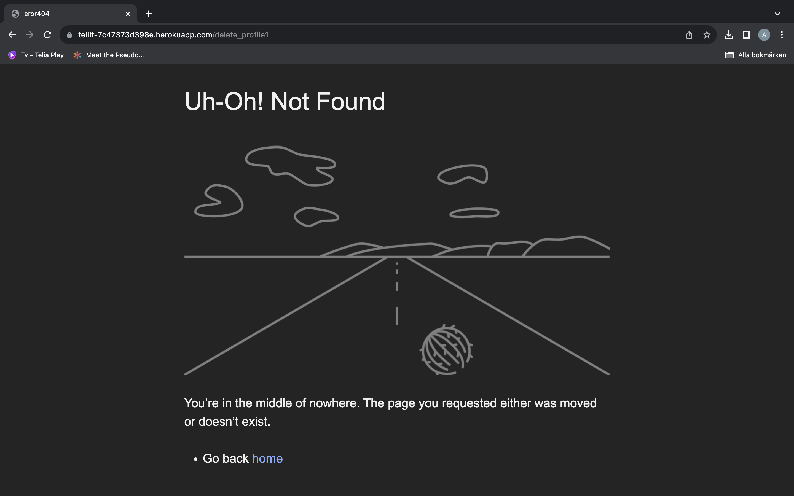

# Tellit
## Introduction

Have you ever wondered at one time how much social media is around? And each of them offers thousands of opportunities for communication between people. My TellIt project is an attempt to create one of these social networks. In this network, you can search for idols, watch their posts, and like the ones you like. And this is just the beginning!

[Live version.](https://tellit-7c47373d398e.herokuapp.com/)

## Existing Features

- User login/logout.
- Creating/deleting user or post.
- User Search.
- A minigame on error pages.
- Edit user profile.

### Main Page

On the home page you can see `+`, this is a drop-down menu where you can add your photo and a description to it, after submitting your photo will be saved in our AWS storage and placed in your profile.

Also on this page, you can see posts of users you are subscribed to.

### Settings

On this page, you can customize the user's photo with their bio and write your birthday.

### Search

The search works on the principle of finding similar names among all users and then you will be presented with a page with all the possible options, where you can find your friends and subscribe to them to see updates from their life on the woof page.

### SignIn/SignUp

On these pages, you initialize the user in our system.

### Delete

On this page, you can delete a user.

On this page, you can delete posts.

### Error pages

For errors on the server side or errors during routing, I decided to implement a mini-game the result in this game is not, but you can try to set a record and put it in our social network. To return you need to click `Go back`.

#### Future Features 

- Messenger
- Commenting on photos

## Testing

I have manually tested this project by doing the following:
 - Passed the code through a PEP8 linter and confirmed no problems.
 - Given invalid inputs pass.
 - Tested in my local env and the Heroku env.

 ### Bugs

 No bugs.

 #### Solved Bugs

- AWS server communication
  
- Keeping the user logged in to the site. The solution is that now the user name and state of being logged in are saved in cookies.

- The biggest problem I had to solve was the inconsistency of the settings for Heroku because due to an unspecified error that didn't even show up in the logs, I wasted a lot of time. (Solved)

#### Remaining Bugs

- No bugs remaining.

#### Validator Testing

- PEP8
    - No errors were returned from PEP8online.com.

## Deployment

This project was deployed using Heroku.

- Steps for deployment:
    - Fork or clone this repository
    - Create a new Heroku app
    - Set the build packs to `Python` in that order
    - Link the Heroku app to the repository
    - Click on Deploy
